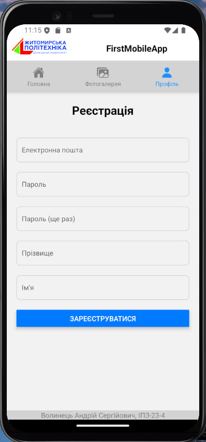
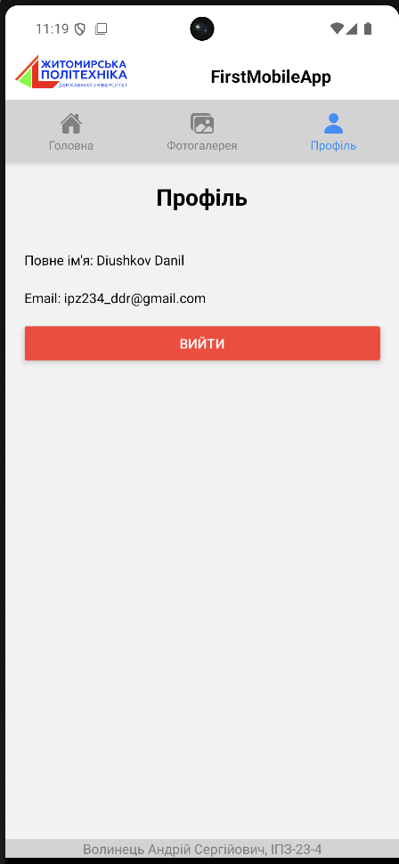

## Інструкція по запуску

1. Встановити залежності

   ```bash
   npm install
   ```

2. Запустити застосунок

   ```bash
   npx expo start
   ```

Після цього з'являться опції для відкриття програми на вашому пристрої.

## Опис сторінок застосунку

1. Головна сторінка – відображає статичні новини.

   

2. Фотогалерея – містить динамічні зображення, які завантажуються під час прокрутки.

   

3. Профіль – дозволяє зареєструватися, переглядати інформацію про свій акаунт і виконати вихід з нього.

   
   

