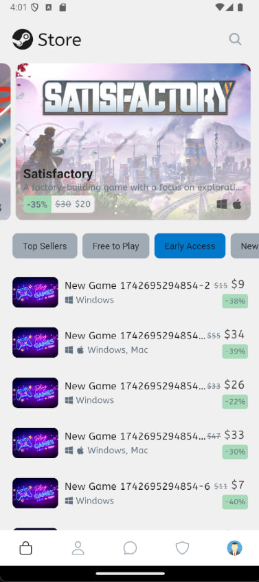
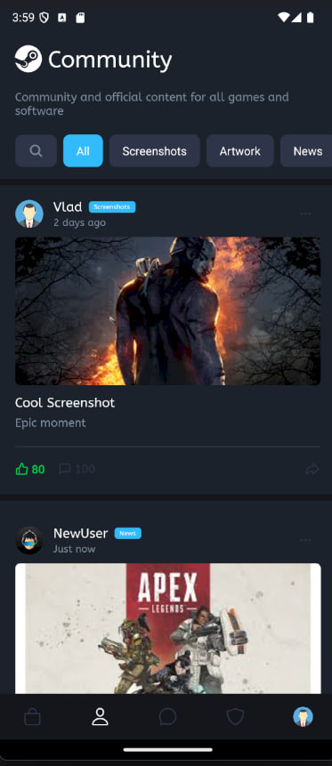
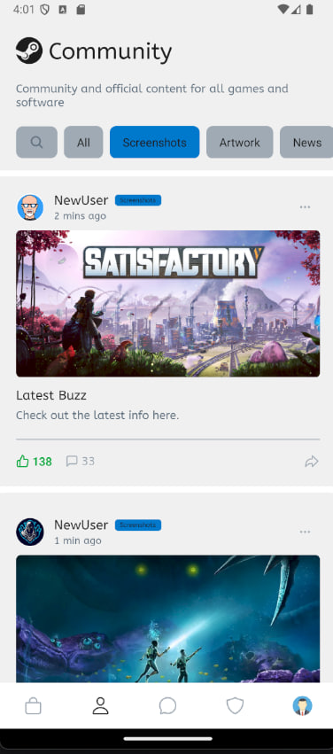
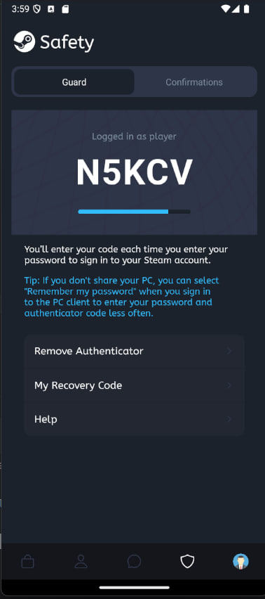
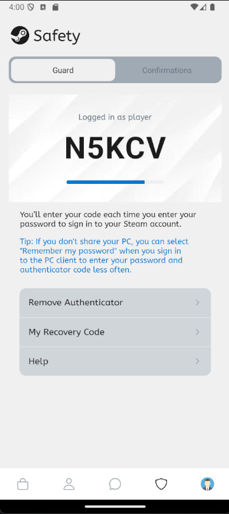
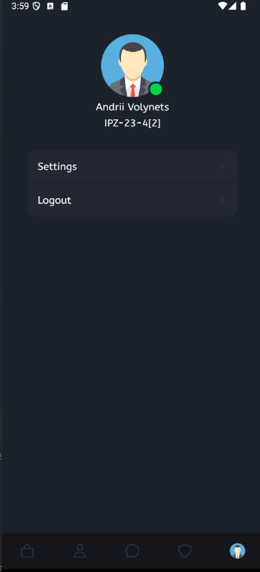
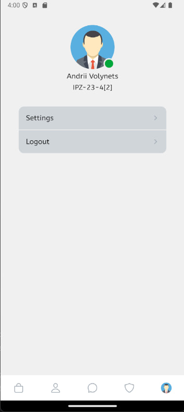
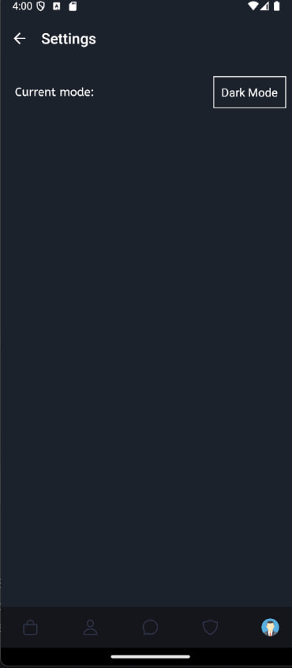
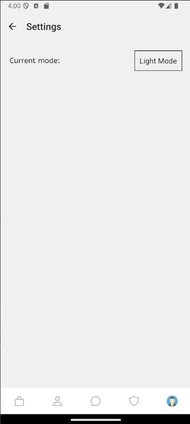

## Інструкція по запуску

1. Встановити залежності

   ```bash
   npm install
   ```

2. Запустити застосунок

   ```bash
   npx expo start
   ```

Після цього з'являться опції для відкриття програми на вашому пристрої.

## Опис сторінок застосунку

1. Головна сторінка – магазин з пропозиціями, містить сортування за категоріями.

   
   

2. Спільнота – містить пости від спільноти різних категорій.

   
   
3. Чати – Сторінка зі списком чатів.

   
   

4. Безпека - статична сторінка з відповідним вмістом.

   
   
5. Налаштування профілю - містить інформацію про власника та можливість переходу до налаштувань.

   
   

5.1. У налаштуваннях - можливість зміни кольорової теми

   
   
