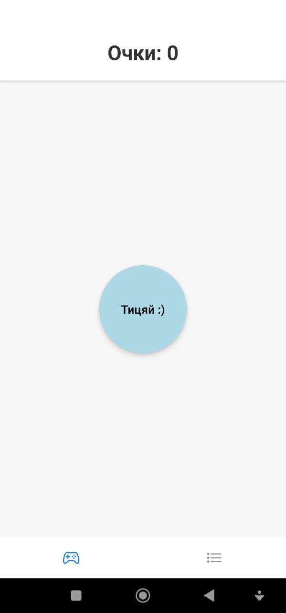
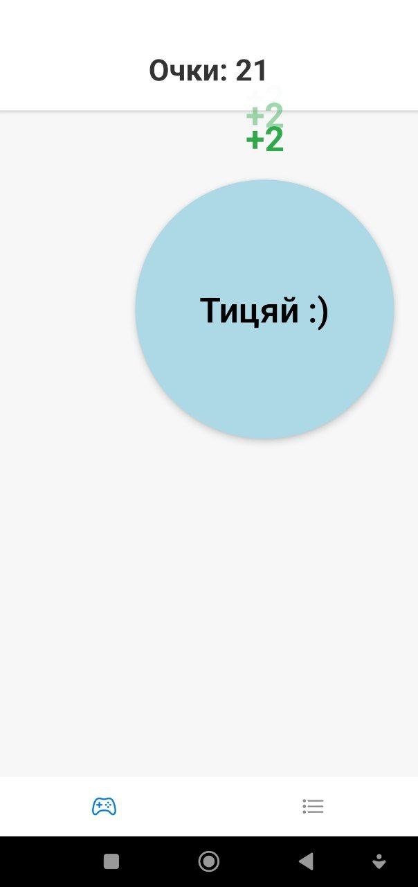
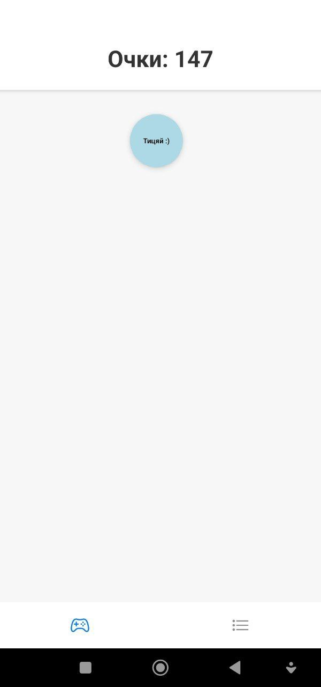
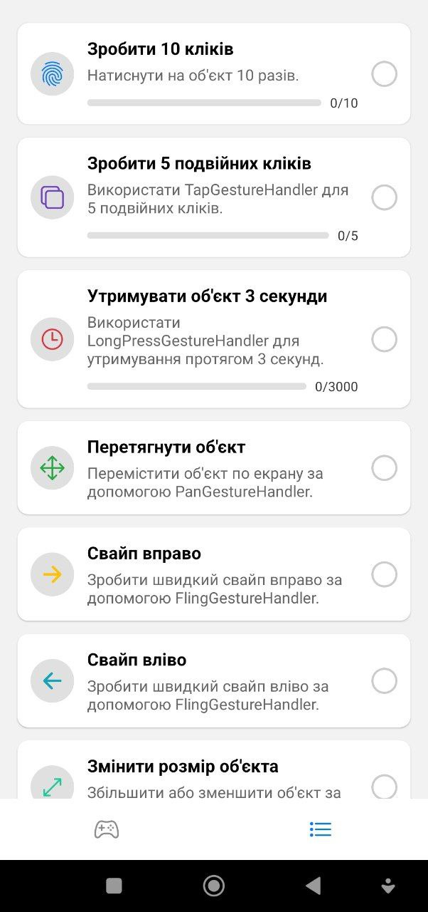
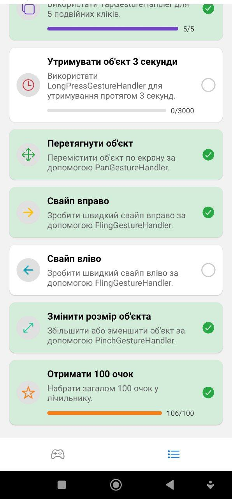

## Інструкція по запуску

1. Встановити залежності

   ```bash
   npm install
   ```

2. Запустити застосунок

   ```bash
   npx expo run:android
   ```

Після цього з'являться опції для відкриття програми на вашому пристрої.

## Опис сторінок застосунку

1. Головна сторінка – містить об'єкт, з яким можна взаємодіяти за допомогою жестів, а також лічильник кліків.

   

   Реалізовано усі необхідні взаємодії, на знімках продемонстровано масштабування, а також отримання очок.

   
   

2. Сторінка завдань – містить набір завдань з відстеженням виконання

   
   