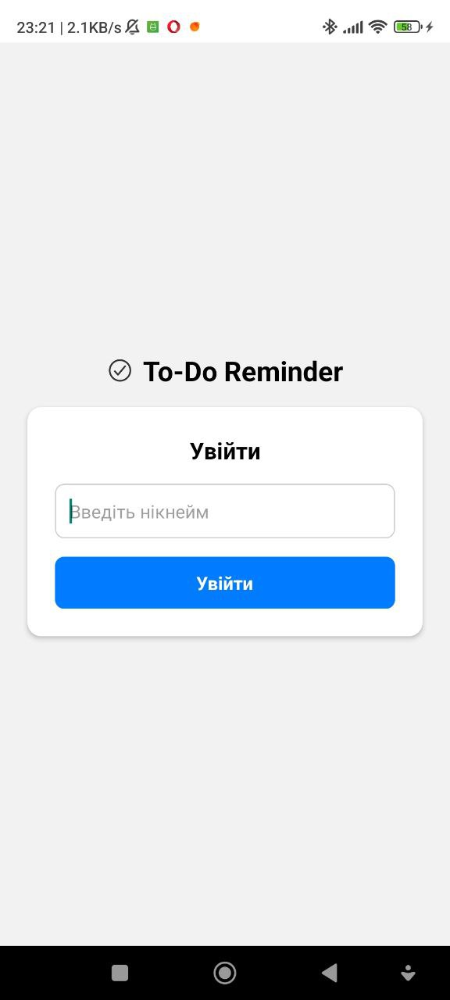
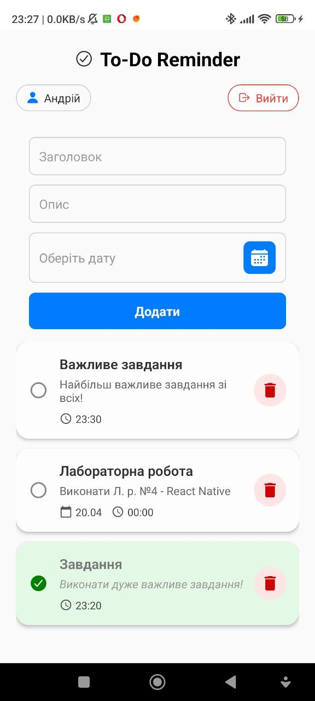
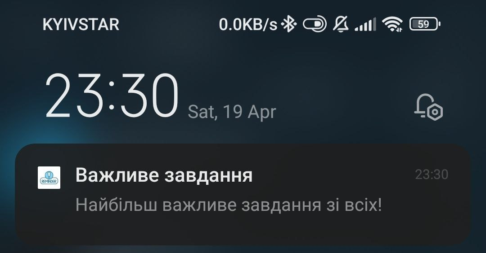
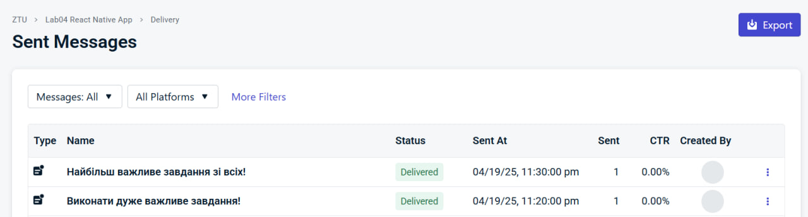
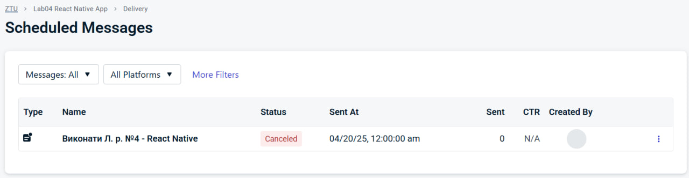

## Інструкція по запуску

1. Встановити залежності

   ```bash
   npm install
   ```

2. Запустити застосунок

   ```bash
   npx expo run:android
   ```

Після цього з'являться опції для відкриття програми на вашому пристрої.

## Опис застосунку

1. Форма входу - містить поле для вводу імені користувача.

   

2. Сторінка завдань
   
   Дозволяє вийти/додати нове завдання/переглянути список завдань/скасувати завдання

   
   
   Приклад сповіщення:

   

   Відправлені сповіщення:   

   

   Скасоване сповіщення:

   
3. Додаткові відомості:

   При отриманні push notification під час використання додатку - відповідне завдання позначається як виконане.
   
   Виконані завдання загораються зеленим кольором.
   
   Усі завдання зберігаються в AsyncStorage для відповідного імені користувача.